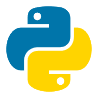

### Hi I'm Ten   一名Java后端工程师 👋

***活在世上，无非想要明白些道理，遇到些有趣的事，倘若如愿这一生就算成功***

  
  

- 🔭 我目前正在中国深圳工作
- 🌱 我目前正在学习Go语言和算法
- 📫 这是我的邮箱地址: [lifeJuly@hotmail.com](mailto:lifeJuly@hotmail.com);
- 😄 代词：有趣、幽默、严肃、负责
- 💬 about me: Ten, 工程师. 我喜欢 Ten 这个数字, 这既是我的生日月份，也是我名字中最后一个单词的谐音。
此外，喜欢音乐，无关旋律。喜欢电影，无论长短，尤其悬疑和解谜，我对知识和智慧充满渴望
 

***技术栈和开发工具:***

 

<code></code>
<code></code>
<code></code>
<code></code>
<code></code>
<code></code>
<code></code>

----------
